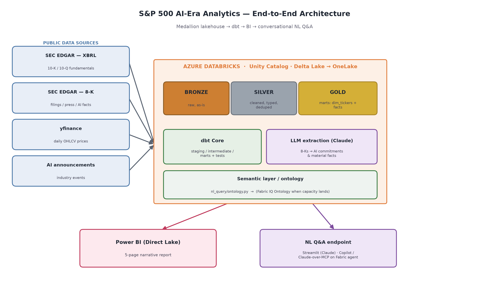

# SP500 AI-Era Analytics — End-to-End Data Engineering Portfolio

An end-to-end data platform analyzing **S&P 500 companies over the last 5 years**,
with a focus on how the AI boom shows up in their fundamentals, stock performance,
and public commitments.

This repository is a **portfolio project**. It demonstrates a complete modern data
engineering stack — multi-source ingestion, a lakehouse with Medallion architecture,
dbt transformations with tests and documentation, an LLM-based extraction pipeline,
and AI-friendly analytics (natural-language Q&A + Power BI dashboards).

> **Status:** scaffolding / work in progress. See [Roadmap](#roadmap).

---

## Architecture



<details>
<summary>Text (ASCII) version</summary>

```
                              ┌────────────────────────────────────────────┐
   PUBLIC DATA SOURCES        │              AZURE DATABRICKS               │
                              │            (Delta Lake / OneLake)           │
 ┌──────────────────┐        │                                             │
 │ SEC EDGAR (XBRL) │──┐     │   BRONZE            SILVER          GOLD     │
 │  10-K / 10-Q     │  │     │  (raw, as-is) ──► (cleaned,    ──► (marts,   │
 └──────────────────┘  │     │   ingestion)       typed,         business  │
 ┌──────────────────┐  │     │                    deduped)       ready)    │
 │ SEC EDGAR 8-K    │──┼────►│      │                │              │       │
 │  filings/press   │  │     │      │   ┌────────────┴───┐    ┌─────┴─────┐ │
 └──────────────────┘  │     │      │   │   dbt Core     │    │ NL Q&A    │ │
 ┌──────────────────┐  │     │      │   │ staging /      │    │ (Claude   │ │
 │ yfinance prices  │──┤     │      │   │ intermediate / │    │  text-to- │ │
 │  daily OHLCV     │  │     │      │   │ marts + tests  │    │  SQL)     │ │
 └──────────────────┘  │     │      ▼   └────────────────┘    └───────────┘ │
 ┌──────────────────┐  │     │   LLM extraction layer                       │
 │ Earnings calls / │──┘     │   (Claude over transcripts/8-Ks →            │
 │ AI announcements │        │    structured AI-commitment table)           │
 └──────────────────┘        └───────────────────┬──────────────────────────┘
                                                  │
                                                  ▼
                                      ┌───────────────────────┐
                                      │  Power BI dashboards   │
                                      │  + NL Q&A interface    │
                                      └───────────────────────┘
```

</details>

See [`docs/architecture.md`](docs/architecture.md) for the detailed design,
data model, and the Medallion (Bronze/Silver/Gold) layering rationale.

---

## Tech Stack

| Layer | Tool | Why |
|-------|------|-----|
| Lakehouse / compute | **Azure Databricks** (Delta Lake, Spark) | Industry-standard DE platform; Medallion architecture |
| Transformation | **dbt Core** | Declarative SQL modeling, tests, lineage, docs |
| Ingestion | **Python** (yfinance, SEC EDGAR API) | Free public data sources |
| LLM extraction & Q&A | **Claude API** | NLP extraction of AI commitments; natural-language Q&A |
| BI / dashboards | **Power BI Desktop** | Native Databricks connector; free; Copilot-friendly |
| Orchestration | **Databricks Jobs** / GitHub Actions | Scheduling + CI |

---

## Data Sources (all free)

| Source | Data | Auth | Notes |
|--------|------|------|-------|
| [SEC EDGAR](https://www.sec.gov/edgar/sec-api-documentation) | XBRL fundamentals (10-K/10-Q), 8-K filings | None (User-Agent required) | Bulk + per-company APIs |
| [yfinance](https://github.com/ranaroussi/yfinance) | Daily OHLCV prices | None | ~5y daily history |
| Earnings transcripts | AI commitment text | Varies | Used by the LLM extraction layer |
| Curated seed file | Major AI industry events (GPT-4, Claude, Gemini launches) | N/A | [`dbt/sp500_analytics/seeds/ai_industry_events.csv`](dbt/sp500_analytics/seeds/ai_industry_events.csv) |

---

## Repository Layout

```
.
├── ingestion/          # Python: pull raw data into the Bronze layer
├── extraction/         # LLM pipeline: extract AI commitments from text
├── dbt/sp500_analytics/# dbt project: staging → intermediate → marts
├── nl_query/           # Natural-language Q&A app (text-to-SQL)
├── dashboards/         # Power BI files + screenshots + design notes
├── docs/               # Architecture & data model documentation
└── .github/workflows/  # CI (dbt parse, python lint)
```

---

## Analytical Deliverables

1. **Natural-language Q&A** — ask questions in plain English; get SQL-backed
   answers, charts, and narrative text. Powered by Claude reading the dbt catalog.
2. **Company-vs-company fundamentals** — compare two companies' financials over time.
3. **AI investment commitments** — how much each company has committed to AI,
   sliced by cash flow, revenue, profit, market cap, etc.
4. **Stock price + events overlay** — price over time with tooltips for quarterly
   results and major AI announcements (company-specific and industry-wide).

---

## Getting Started

> Full setup instructions live in each subfolder's `README.md`.

```bash
# 1. Python environment
python -m venv .venv && source .venv/bin/activate
pip install -r requirements.txt

# 2. Configure secrets (never commit real values)
cp .env.example .env   # then fill in values

# 3. Pull a small sample of raw data
python -m ingestion.sp500_constituents
python -m ingestion.market_prices --limit 10
python -m ingestion.edgar_fundamentals --limit 10

# 4. Run dbt (after pointing profiles.yml at your warehouse)
cd dbt/sp500_analytics
dbt deps && dbt seed && dbt build
dbt docs generate && dbt docs serve
```

---

## Synthetic vs. real data

The repo runs out-of-the-box on **synthetic sample data** (3 companies, fabricated
numbers, `example.com` source links) so dbt, the NL Q&A app, and the dashboards work
offline and for free. The bundled snapshot in `nl_query/sample_data/` is synthetic too.

To replace it with **real data** (live SEC EDGAR + Yahoo Finance + LLM extraction),
run this on your machine (needs internet and `ANTHROPIC_API_KEY` in `.env`):

```bash
# 1. Real ingestion
python -m ingestion.sp500_constituents
python -m ingestion.market_prices
python -m ingestion.edgar_fundamentals
python -m ingestion.edgar_filings

# 2. Real LLM extraction (start with a small --limit to check cost)
python -m extraction.ai_commitment_extractor --limit 50
python -m extraction.ai_material_facts_extractor --limit 50

# 3. Rebuild the warehouse
cd dbt/sp500_analytics
dbt build --target duckdb          # local; or --target databricks for the cloud
cd ../..

# 4. Refresh the deployed NL Q&A app's bundled snapshot, then commit
python -m scripts.export_nl_query_sample
git add nl_query/sample_data/*.parquet
git commit -m "Refresh NL Q&A bundle with real data" && git push
```

For the **Databricks/Power BI** side, also re-upload the refreshed Bronze Parquet to
the Unity Catalog volume and rebuild on `--target databricks` (see
[`docs/cloud-setup.md`](docs/cloud-setup.md) Part A6b), then refresh in Power BI.

> Until you run the above, everything works — it's just showing synthetic data.

---

## Roadmap

- [x] Repository scaffold, architecture docs, dbt project skeleton
- [x] Ingestion scripts (S&P 500 list, yfinance prices, EDGAR fundamentals/filings)
- [x] AI industry events seed file
- [x] Ingestion output loaded to Databricks Bronze (Delta / Unity Catalog)
- [x] Silver/Gold dbt models + tests (medallion; star schema with `dim_tickers`)
- [x] LLM extraction pipeline (AI commitments + material AI facts, source-linked)
- [x] Natural-language Q&A app (ontology-grounded text-to-SQL; deployed to Streamlit)
- [x] Power BI semantic model + 5-page Direct Lake report (DAX measures, Deneb visual)
- [x] CI (dbt build on DuckDB + ruff) and Delta `OPTIMIZE`/`ZORDER` post-hooks
- [ ] Power BI report screenshots for the portfolio
- [ ] Microsoft Fabric: F2 capacity → mirror catalog → Direct Lake (awaiting quota)
- [ ] Fabric IQ Ontology + data agent (Copilot / Claude-over-MCP)
- [ ] Databricks Jobs orchestration (scheduled refresh)

---

## License

MIT — see [`LICENSE`](LICENSE). Data belongs to its respective providers; this
project stores code, not redistributed datasets.
